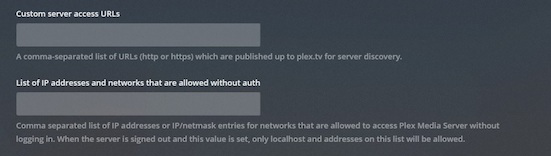

## Starting the container

Docker run

```shell
docker run --rm \
    --name plex \
    -p 32400:32400 \
    -e PUID=1000 \
    -e PGID=1000 \
    -e UMASK=002 \
    -e TZ="Etc/UTC" \
    -e PLEX_CLAIM_TOKEN="" \
    -e PLEX_ADVERTISE_URL="" \
    -e PLEX_NO_AUTH_NETWORKS="" \
    -e PLEX_BETA_INSTALL="false" \
    -e PLEX_PURGE_CODECS="false" \
    -v /<host_folder_config>:/config \
    -v /<host_folder_transcode>:/transcode \
    -v /<host_folder_data>:/data \
    docker.io/tainrs/plex
```

Docker compose:

```yaml
services:
    plex:
    container_name: plex
    image: docker.io/tainrs/plex
    ports:
        - "32400:32400"
    environment:
        - PUID=1000
        - PGID=1000
        - UMASK=002
        - TZ=Etc/UTC
        - PLEX_CLAIM_TOKEN
        - PLEX_ADVERTISE_URL
        - PLEX_NO_AUTH_NETWORKS
        - PLEX_BETA_INSTALL=false
        - PLEX_PURGE_CODECS=false
    volumes:
        - /<host_folder_config>:/config
        - /<host_folder_transcode>:/transcode
        - /<host_folder_data>:/data
```

## Volumes

By default the container has 2 volumes defined, the volume `/config` that contains the configuration files and the volume `/transcode` which is used as the default transcode directory.

## Claim your server

When running Plex on a docker `bridge` network, you can't just get to the webui and start configuring it, you'll need to claim it first. Go to [plex.tv/claim](https://www.plex.tv/claim) and login with your account, copy the claim token and add it to the environment variable like this `-e PLEX_CLAIM_TOKEN="claim-xxxxxxxxxxxxxxxxxxxx"`. When starting the new plex server for the first time, the server will be added to your account.

## Environment variables PLEX_ADVERTISE_URL and PLEX_NO_AUTH_NETWORKS

The variables correspond to the below plex network settings.



The variable `PLEX_ADVERTISE_URL` is useful to aid your local clients in discovering your plex server when running in the `bridge` network mode. Most likely you would use something like `http://192.168.0.10:32400`. You could use `PLEX_NO_AUTH_NETWORKS` when you're locked out and need to regain access without providing credentials.

## Getting a token

The following command will interactively ask for your credentials and give you a token. If you don't use 2FA, just press enter.

```shell
docker run --rm -it --name plex --entrypoint="" tainrs/plex bash /app/get-token.sh
```

## TOP secret stuff

If you do `-e PLEX_BETA_INSTALL="https://..."`, stuff happens for which no support will be given.
